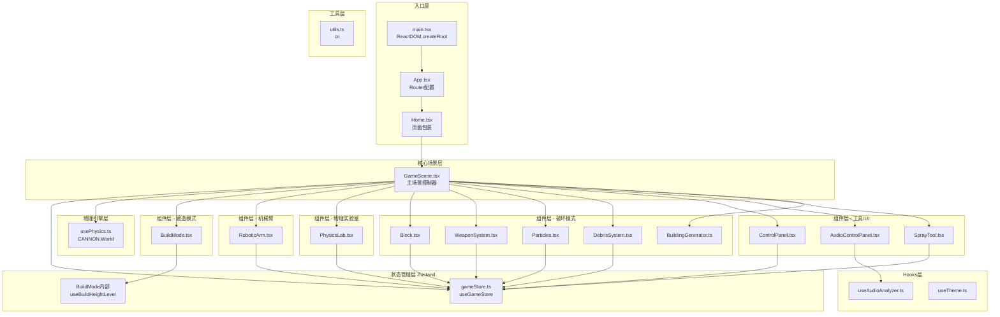
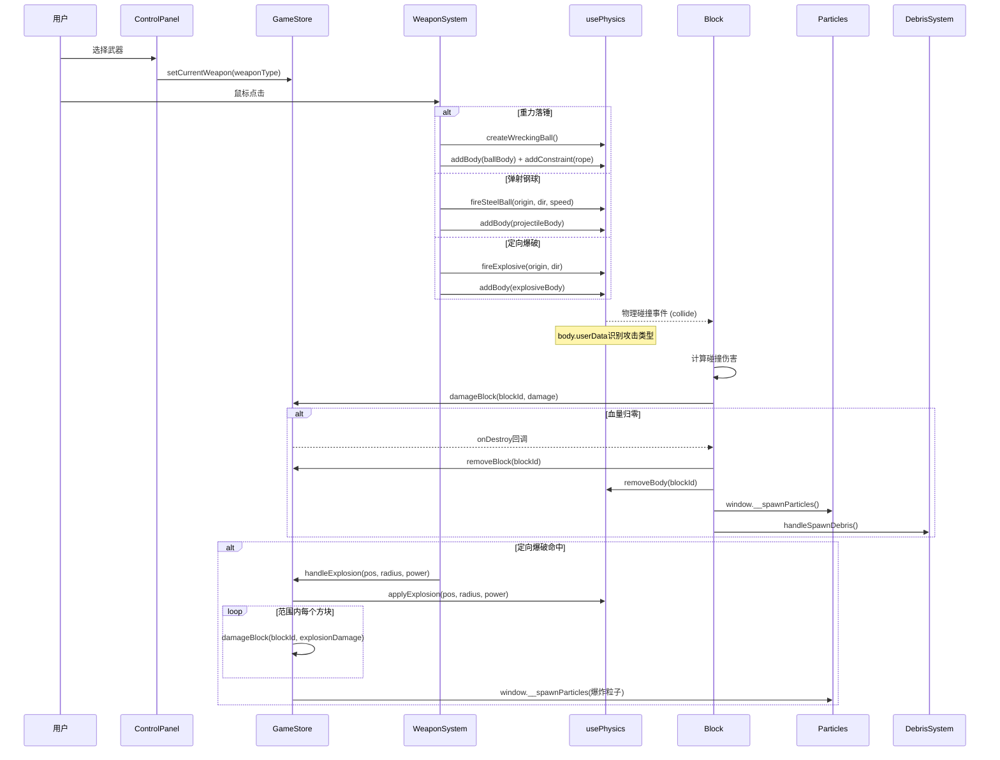
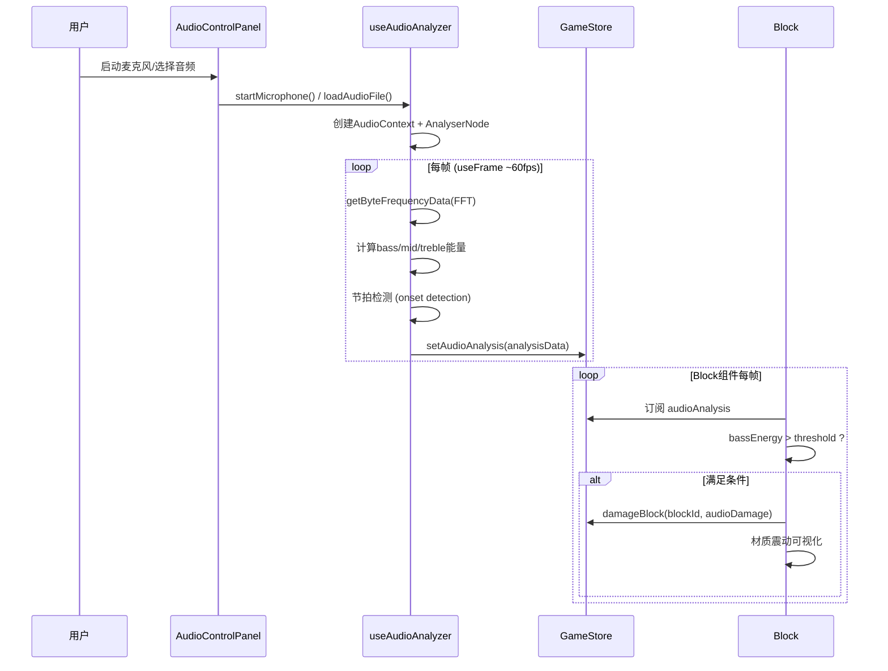
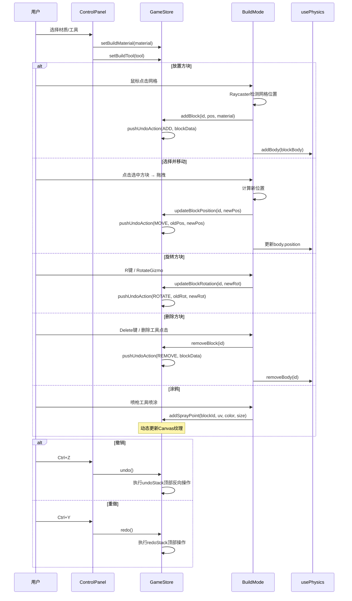
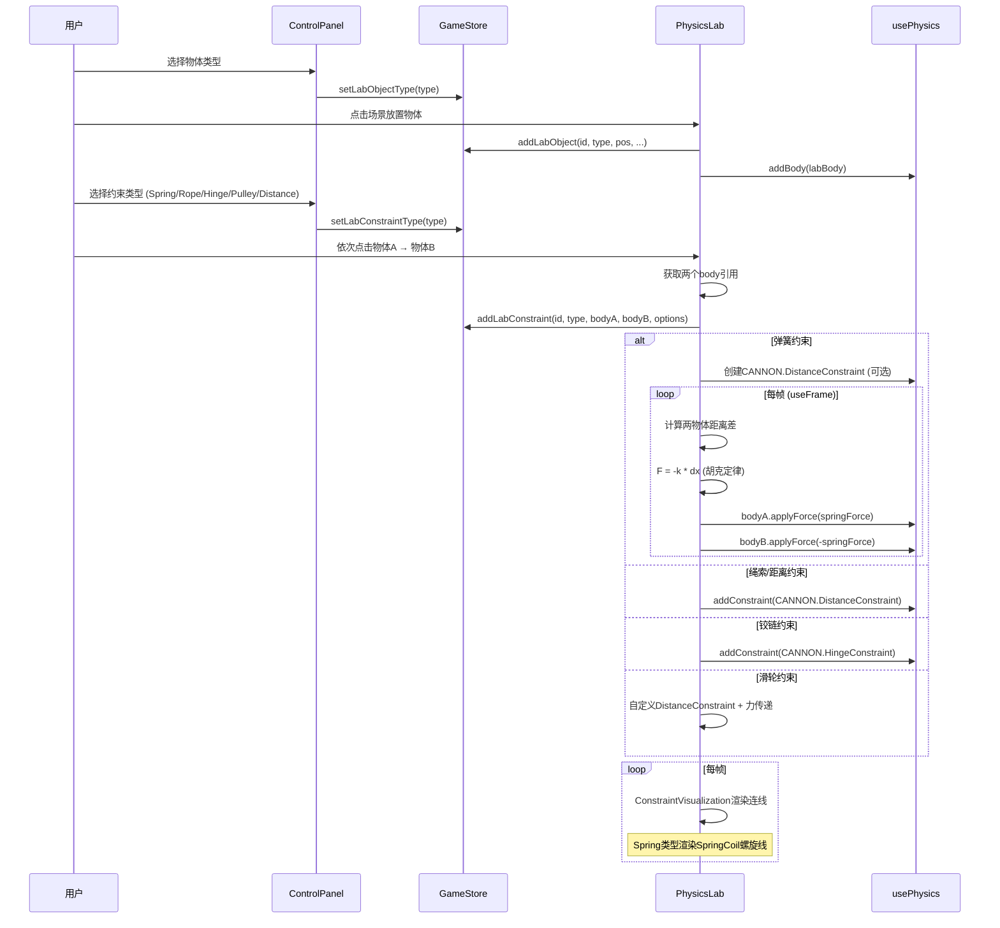
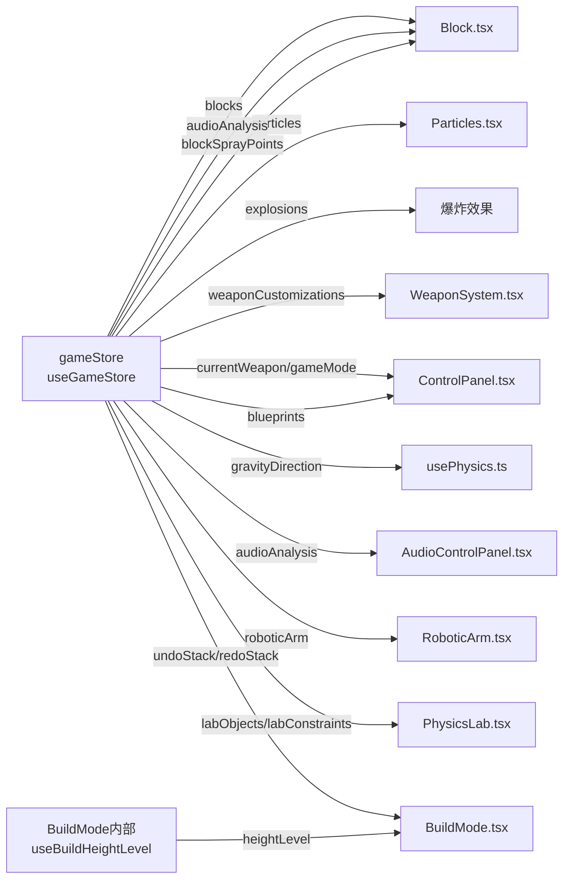
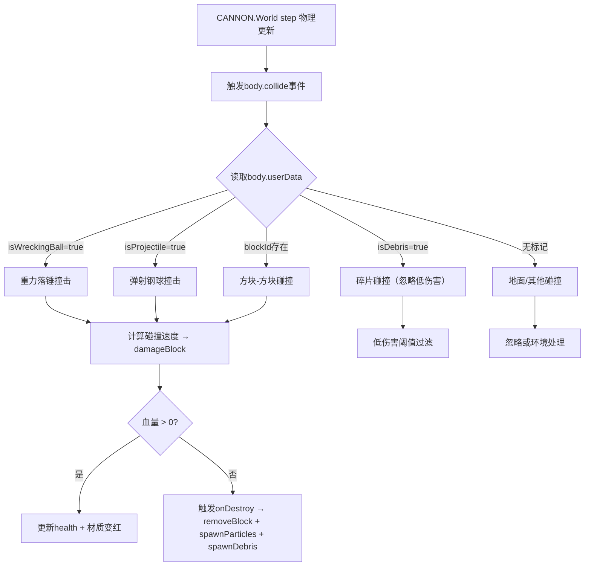

# 物理破坏游戏 - 事件流与架构文档

## 1. 整体架构图



---

## 2. 跨组件通信方式

| 通信方式 | 使用场景 | 说明 |
|---------|---------|------|
| **Zustand全局状态 (useGameStore)** | 所有组件共享 | 包含blocks/particles/explosions、武器配置、游戏模式、音频分析、机械臂状态、物理实验室数据、蓝图等 |
| **Props回调传递** | GameScene → 子组件 | 将usePhysics返回的物理操作函数和handleDestroyBlock/handleSpawnDebris/handleExplosion等回调向下传递 |
| **Ref回调注册模式** | DebrisSystem → GameScene | 通过`registerSpawner(spawner)`回调将碎片生成函数注册到GameScene的`spawnDebrisRef` |
| **Window全局函数** | Particles → 其他组件 | 将`spawnParticles`挂载到`window.__spawnParticles`，供其他组件直接调用 |
| **CANNON.Body.userData** | 物理碰撞识别 | 传递isWreckingBall/isProjectile/isDebris/blockId等标识信息 |
| **Three.js Object3D.userData** | Raycaster射线检测 | 传递blockId/isBuildBlock等标识 |
| **BuildMode内部独立zustand store** | 建造模式高度层 | `useBuildHeightLevel`仅用于建造模式的高度层级管理 |

---

## 3. 模块函数输入输出与副作用

### 3.1 gameStore.ts (核心状态管理)

| 函数/Action | 输入 | 输出 | 副作用 |
|------------|------|------|--------|
| `addBlock` | id: string, position: [x,y,z], material: MaterialType, size?: [x,y,z], color?: string | void | blocks Map新增条目；pushUndoAction |
| `removeBlock` | id: string | void | blocks Map删除；blockSprayCanvases/blockSprayPoints清理；pushUndoAction |
| `damageBlock` | id: string, damage: number | boolean (是否摧毁) | 更新block.health；血量归零时调用onDestroy回调；spawnParticles + spawnDebris |
| `addSprayPoint` | blockId: string, position: {x,y}, color: string, size: number | void | blockSprayPoints新增；blockSprayCanvases对应canvas绘制 |
| `addParticle` | id, position, velocity, color, size, life, type | void | particles Map新增 |
| `removeParticle` | id: string | void | particles Map删除 |
| `addExplosion` | id, position, radius, power, color | void | explosions Map新增 |
| `removeExplosion` | id: string | void | explosions Map删除 |
| `setGameMode` | mode: GameMode | void | 更新gameMode |
| `setCurrentWeapon` | weapon: WeaponType | void | 更新currentWeapon |
| `upgradeWeapon` | weapon: WeaponType | void | 更新weaponCustomizations对应武器等级 |
| `setWeaponAppearance` | weapon, color, trailColor, sizeMultiplier | void | 更新武器外观配置 |
| `setGravityDirection` | direction: GravityDirection | void | 更新gravityDirection |
| `setAudioAnalysis` | analysis: AudioAnalysisData | void | 更新audioAnalysis |
| `undo` | - | void | 弹出undoStack，执行反向操作，推入redoStack |
| `redo` | - | void | 弹出redoStack，执行操作，推入undoStack |
| `pushUndoAction` | action: UndoAction | void | undoStack推入；清空redoStack |
| `saveBlueprint` | name: string | void | localStorage存储blueprints |
| `loadBlueprint` | id: string | BlueprintData \| null | 从localStorage读取 |
| `deleteBlueprint` | id: string | void | 从localStorage删除 |
| `setRoboticArmBaseRotation` | angle: number | void | 更新roboticArm.baseRotation |
| `setRoboticArmShoulderAngle` | angle: number | void | 更新roboticArm.shoulderAngle |
| `setRoboticArmElbowAngle` | angle: number | void | 更新roboticArm.elbowAngle |
| `setRoboticArmWristAngle` | angle: number | void | 更新roboticArm.wristAngle |
| `setRoboticArmGrabbedBlock` | blockId: string \| null | void | 更新roboticArm.grabbedBlockId |
| `addLabObject` | id, type, position, rotation, scale, mass, color | void | labObjects Map新增 |
| `removeLabObject` | id: string | void | labObjects Map删除 |
| `addLabConstraint` | id, type, bodyA, bodyB, options | void | labConstraints Map新增 |
| `removeLabConstraint` | id: string | void | labConstraints Map删除 |

**副作用汇总：**
- 操作模块级 `blockSprayCanvases: Map<string, HTMLCanvasElement>`
- 操作模块级 `blockSprayPoints: Map<string, Array<{...}>>`
- 动态创建 `HTMLCanvasElement` 用于涂鸦纹理
- `localStorage` 持久化存储蓝图数据

---

### 3.2 usePhysics.ts (物理引擎Hook)

| 函数 | 输入 | 输出 | 副作用 |
|------|------|------|--------|
| `addBody` | id: string, body: CANNON.Body | void | world.addBody；bodies Map存储 |
| `removeBody` | id: string | void | world.removeBody；bodies Map删除 |
| `getBody` | id: string | CANNON.Body \| undefined | 无 |
| `addConstraint` | id: string, constraint: CANNON.Constraint | void | world.addConstraint；constraints Map存储 |
| `removeConstraint` | id: string | void | world.removeConstraint；constraints Map删除 |
| `step` | - | void | world.step(dt)；每帧调用 |
| `applyExplosion` | position: CANNON.Vec3, radius: number, power: number | void | 遍历所有body计算距离；施加冲量 |

---

### 3.3 useAudioAnalyzer.ts (音频分析Hook)

| 函数/返回值 | 输入 | 输出 | 副作用 |
|------------|------|------|--------|
| `startMicrophone` | - | Promise<void> | navigator.mediaDevices.getUserMedia；创建AudioContext/MediaStreamSource/Analyser |
| `loadAudioFile` | file: File | Promise<void> | 创建AudioElement/MediaElementSource/Analyser |
| `togglePlay` | - | void | audio.play()/pause() |
| `stop` | - | void | 停止所有音频源；关闭AudioContext |
| `setOutputVolume` | volume: number | void | gainNode.gain.value更新 |
| `sourceType` (state) | - | 'microphone' \| 'file' \| null | 无 |
| `isPlaying` (state) | - | boolean | 无 |
| `analysis` (state) | - | AudioAnalysisData | 每帧useFrame更新FFT频谱/分频段能量/节拍检测 |
| `volume` (state) | - | number | 无 |

---

### 3.4 GameScene.tsx (主场景控制器)

| 回调函数 | 输入 | 输出 | 副作用 |
|---------|------|------|--------|
| `handleDestroyBlock` | id: string | void | removeBlock(id)；removeBody(id) |
| `handleSpawnDebris` | position, velocity, material, size, color | void | spawnDebrisRef.current?.() 调用已注册的碎片生成器 |
| `registerSpawner` | spawner: Function | void | spawnDebrisRef.current = spawner |
| `handleExplosion` | position, radius, power, color | void | addExplosion；applyExplosion；遍历blocks在范围内damageBlock；window.__spawnParticles |
| `handleRegenerateBuilding` | - | void | 清除所有blocks/particles/explosions；重新generateBuilding |
| `handleReset` | - | void | 清除所有blocks/particles/explosions/labObjects/labConstraints |
| `handleLoadBlueprint` | blueprint: BlueprintData | void | 清除现有blocks；按蓝图数据逐个addBlock |

---

### 3.5 Block.tsx (方块组件)

| 函数/逻辑 | 输入 | 输出 | 副作用 |
|----------|------|------|--------|
| 碰撞事件监听 | body.collide事件 | void | 计算相对速度 → damageBlock；音频可视化：damage比例叠加FFT bass驱动崩解 |
| 音频驱动崩解 | useFrame每帧读取audioAnalysis | void | 持续根据bass/treble能量调用damageBlock |
| `onDestroy`回调 | - | void | handleDestroyBlock；spawnParticles；handleSpawnDebris |
| 涂鸦纹理更新 | useGameStore订阅blockSprayPoints | void | mesh.material.map = canvasTexture；needsUpdate = true |

**Props输入：** id, position, material, size, color, health, addBody, removeBody, onDestroy, spawnDebris

---

### 3.6 WeaponSystem.tsx (武器系统)

| 函数 | 输入 | 输出 | 副作用 |
|------|------|------|--------|
| `createWreckingBall` | - | void | 创建CANNON.Body + THREE.Mesh；DistanceConstraint连接到锚点；body.userData.isWreckingBall = true |
| `removeWreckingBall` | - | void | removeBody；removeConstraint；从Three.js移除mesh |
| `fireSteelBall` | origin: Vec3, direction: Vec3, speed: number | void | 创建弹射钢球Body/Mesh；设置初速度；body.userData.isProjectile = true；设置lifetime自动销毁 |
| `fireExplosive` | origin: Vec3, direction: Vec3 | void | 创建抛射物Body/Mesh；抛物线运动；碰撞或到达时触发handleExplosion |
| `updateLauncherAppearance` | - | void | 根据weaponCustomizations更新发射器颜色/大小/拖尾 |

**鼠标事件处理：**
- mousedown: 根据武器类型启动发射/创建落锤
- mousemove: 更新瞄准方向/拖拽预览
- mouseup: 释放触发/发射

---

### 3.7 Particles.tsx (粒子系统)

| 函数 | 输入 | 输出 | 副作用 |
|------|------|------|--------|
| `spawnParticles` (工具函数) | position, count, color, size, velocity, life, type | void | 批量addParticle；挂载到window.__spawnParticles |
| `spawnExplosion` (工具函数) | position, radius, color, power | void | addExplosion；生成球形扩散粒子 |

**组件内部：** useFrame每帧更新所有粒子位置/生命周期；过期粒子自动removeParticle

---

### 3.8 DebrisSystem.tsx (碎片系统)

| 函数 | 输入 | 输出 | 副作用 |
|------|------|------|--------|
| `registerSpawner` 回调 | spawner函数 | void | 注册到父组件GameScene |
| `spawnDebris` (内部) | position, velocity, material, size, color, count | void | 创建多个小碎片Body/Mesh；随机旋转/速度；body.userData.isDebris = true；设置lifetime |

---

### 3.9 BuildMode.tsx (建造模式)

| 子组件/函数 | 输入 | 输出 | 副作用 |
|------------|------|------|--------|
| `BuildGrid` | heightLevel | void | 渲染建造网格平面 |
| `GhostBlock` | position, valid, material | void | 半透明预览方块 |
| `PlacementHandler` | 鼠标点击/拖拽 | void | Raycaster检测 → addBlock → pushUndoAction |
| `KeyboardHandler` | 键盘事件 | void | WASD移动选中块；R旋转；Delete删除；Ctrl+Z/Y撤销重做 |
| `HeightLevelIndicator` | - | void | 显示/切换当前建造高度层 |
| `RotateGizmo` | 选中方块 | void | 可视化旋转控制器 |
| `SprayTool`集成 | 涂鸦模式 | void | 调用addSprayPoint绘制 |

---

### 3.10 BuildingGenerator.ts (建筑生成器)

| 函数 | 输入 | 输出 | 副作用 |
|------|------|------|--------|
| `generateBuilding` | width, height, depth, gravityDirection, materialMix | BlockData[] | 程序化生成楼层/墙体/窗户/屋顶 |
| `generateCastle` | size, gravityDirection | BlockData[] | 生成塔楼/城墙/城门/护城河结构 |

---

### 3.11 RoboticArm.tsx (机械臂)

| 函数/逻辑 | 输入 | 输出 | 副作用 |
|----------|------|------|--------|
| 键盘控制循环 | useFrame检测按键 | void | 更新setRoboticArmBaseRotation/Shoulder/Elbow/Wrist角度 |
| 抓取逻辑 | 空格键 | void | Raycaster检测最近方块 → setRoboticArmGrabbedBlock；将body设为KINEMATIC；每帧同步位置/旋转 |
| 释放逻辑 | 再次空格 | void | 恢复body为DYNAMIC；setRoboticArmGrabbedBlock(null) |

---

### 3.12 PhysicsLab.tsx (物理实验室)

| 子组件/函数 | 输入 | 输出 | 副作用 |
|------------|------|------|--------|
| `LabObjectMesh` | id, type, position, etc. | void | 创建对应形状的CANNON.Body和THREE.Mesh |
| `ConstraintVisualization` | constraint数据 | void | 渲染约束连接线/弹簧可视化 |
| `SpringCoil` | start, end, turns, radius | void | 生成弹簧螺旋线几何体 |
| 约束放置 | 点击两个物体 | void | addConstraint创建对应类型约束 |
| 弹簧力应用 | useFrame每帧 | void | 对Spring类型约束手动计算并施加弹性力 |

---

### 3.13 SprayTool.tsx (涂鸦喷枪)

| 函数 | 输入 | 输出 | 副作用 |
|------|------|------|--------|
| 喷涂逻辑 | mousedown/mousemove | void | Raycaster命中方块面 → 计算UV坐标 → 调用addSprayPoint |

---

### 3.14 ControlPanel.tsx (控制面板)

| 模式面板 | 主要交互 | 状态操作 |
|---------|---------|---------|
| **破坏模式** | 武器选择、升级按钮、颜色选择器、重力方向切换、蓝图保存/加载 | setCurrentWeapon, upgradeWeapon, setWeaponAppearance, setGravityDirection, saveBlueprint, loadBlueprint, handleRegenerateBuilding |
| **建造模式** | 材质选择、工具切换(放置/选择/涂鸦/删除)、撤销重做按钮 | setBuildTool, setBuildMaterial, undo, redo |
| **机械臂模式** | 关节滑块(底座/肩/肘/腕)、抓取按钮 | setRoboticArmBaseRotation/Shoulder/Elbow/Wrist, setRoboticArmGrabbedBlock |
| **物理实验室** | 物体类型选择(球/盒/圆柱/圆锥)、约束类型选择(弹簧/绳索/铰链/滑轮/距离)、清除按钮 | setLabTool, addLabObject, addLabConstraint, handleReset |

---

### 3.15 AudioControlPanel.tsx (音频控制面板)

| 控件 | 操作 | 副作用 |
|------|------|--------|
| 麦克风按钮 | 点击 | startMicrophone() |
| 文件选择 | 选择音频文件 | loadAudioFile(file) |
| 播放/暂停 | 点击 | togglePlay() |
| 音量滑块 | 拖动 | setOutputVolume(value) |
| FFT可视化 | 自动 | 每帧渲染频谱柱状图 |
| 节拍指示 | 自动 | detection.beat触发时闪烁 |

---

## 4. 游戏模式事件流图

### 4.1 破坏模式 - 武器攻击事件流



### 4.2 音频驱动崩解事件流



### 4.3 建造模式事件流



### 4.4 机械臂模式事件流

```mermaid
sequenceDiagram
    participant User as 用户
    participant CP as ControlPanel
    participant GS as GameStore
    participant RA as RoboticArm
    participant UP as usePhysics
    participant B as Block

    loop 每帧检测按键
        RA->>RA: 检测WASD/QEZ/空格
        alt A/D键
            RA->>GS: setRoboticArmBaseRotation(delta)
        alt W/S键
            RA->>GS: setRoboticArmShoulderAngle(delta)
        alt Q/E键
            RA->>GS: setRoboticArmElbowAngle(delta)
        alt Z/X键
            RA->>GS: setRoboticArmWristAngle(delta)
        end
    end

    User->>RA: 空格键 (抓取)
    RA->>RA: Raycaster检测夹爪附近方块
    RA->>GS: setRoboticArmGrabbedBlock(blockId)
    RA->>UP: getBody(blockId)
    UP-->>RA: body
    RA->>RA: body.type = CANNON.Body.KINEMATIC

    loop 抓取状态每帧
        RA->>RA: 计算夹爪世界坐标
        RA->>UP: body.position = clawPosition
        RA->>UP: body.quaternion = clawQuaternion
    end

    User->>RA: 空格键 (释放)
    RA->>RA: body.type = CANNON.Body.DYNAMIC
    RA->>GS: setRoboticArmGrabbedBlock(null)
    RA->>UP: 赋予当前速度 (可选)
```

### 4.5 物理实验室模式事件流



---

## 5. 状态订阅关系图



---

## 6. 物理碰撞识别链



---

## 7. 文件索引

| 文件 | 路径 | 主要职责 |
|------|------|---------|
| main.tsx | `src/main.tsx` | React应用入口 |
| App.tsx | `src/App.tsx` | 路由配置 |
| Home.tsx | `src/pages/Home.tsx` | 首页包装 |
| GameScene.tsx | `src/components/GameScene.tsx` | 主场景控制器 |
| gameStore.ts | `src/store/gameStore.ts` | Zustand全局状态管理 |
| usePhysics.ts | `src/hooks/usePhysics.ts` | CANNON物理引擎Hook |
| useAudioAnalyzer.ts | `src/hooks/useAudioAnalyzer.ts` | Web Audio API分析Hook |
| useTheme.ts | `src/hooks/useTheme.ts` | 主题切换Hook |
| Block.tsx | `src/components/Block.tsx` | 方块渲染与物理体 |
| WeaponSystem.tsx | `src/components/WeaponSystem.tsx` | 武器系统 |
| Particles.tsx | `src/components/Particles.tsx` | 粒子/爆炸效果 |
| DebrisSystem.tsx | `src/components/DebrisSystem.tsx` | 碎片系统 |
| BuildMode.tsx | `src/components/BuildMode.tsx` | 建造模式 |
| RoboticArm.tsx | `src/components/RoboticArm.tsx` | 机械臂控制 |
| PhysicsLab.tsx | `src/components/PhysicsLab.tsx` | 物理实验室 |
| ControlPanel.tsx | `src/components/ControlPanel.tsx` | UI控制面板 |
| AudioControlPanel.tsx | `src/components/AudioControlPanel.tsx` | 音频控制面板 |
| SprayTool.tsx | `src/components/SprayTool.tsx` | 涂鸦喷枪 |
| BuildingGenerator.ts | `src/components/BuildingGenerator.ts` | 程序化建筑生成 |
| utils.ts | `src/lib/utils.ts` | 工具函数(cn) |
